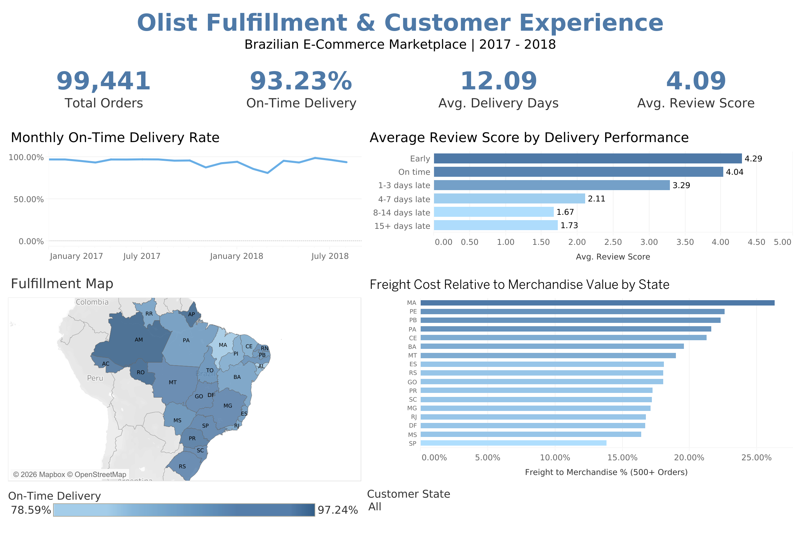
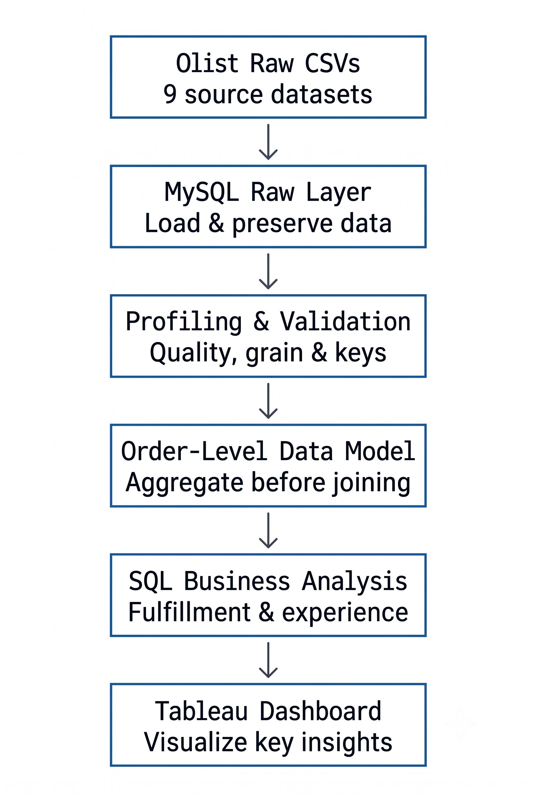
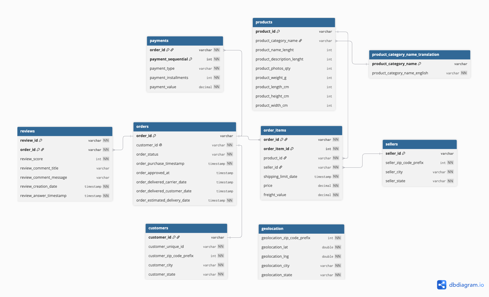

# olist-analysis
SQL and Power BI analysis of Olist e-commerce data with an LLM-to-SQL evaluation component

# Olist E-Commerce Fulfillment & Customer Experience Analytics

**End-to-end e-commerce analytics project using MySQL, SQL, Tableau, Python, and Git/GitHub.**

This project analyzes the Olist Brazilian e-commerce marketplace with a focus on **fulfillment performance and customer experience**. I built the workflow from raw-data ingestion and quality validation through analytical modeling, SQL business analysis, and an interactive Tableau dashboard.

The project emphasizes not only the final insights, but also the modeling decisions required to produce trustworthy metrics from a multi-table transactional dataset—including **analytical grain, one-to-many joins, fanout prevention, metric-specific populations, and source-data quality validation**.

**Author:** Ngoc Gia Han Le  
**GitHub:** [github.com/ngocgiah-lgtm/olist-analysis](https://github.com/ngocgiah-lgtm/olist-analysis)  
**LinkedIn:** [linkedin.com/in/ngoc-gia-han-le](http://www.linkedin.com/in/ngoc-gia-han-le)

---

## Dashboard



### Headline Results

| Metric | Result |
|---|---:|
| Total Orders | **99,441** |
| On-Time Delivery Rate | **93.23%** |
| Average Delivery Time | **12.09 days** |
| Average Review Score | **4.09 / 5** |

The dashboard combines fulfillment KPIs with temporal, customer-experience, geographic, and freight analysis. An interactive state filter supports geographic exploration.

---

## Key Findings

### Delivery reliability was high overall, but late orders experienced substantial delays

Among **96,476 orders** with sufficient information to compare actual and estimated delivery dates, **93.23% were delivered on or before the estimated date**.

The **6,535 late orders** arrived an average of **10.62 days late**.

### Customer reviews deteriorated sharply as delivery performance worsened

Reviewed on-time orders averaged **4.29 stars**, compared with **2.27 stars for late orders**.

Breaking lateness into severity groups reveals a clearer pattern:

| Delivery Performance | Average Review Score |
|---|---:|
| Early | **4.29** |
| On time | **4.04** |
| 1–3 days late | **3.29** |
| 4–7 days late | **2.11** |
| 8–14 days late | **1.67** |
| 15+ days late | **1.73** |

The relationship is strongly associated with delivery performance, but the analysis is observational and **does not establish that lateness alone causes lower review scores**.

### Fulfillment performance varied geographically

Among higher-volume states:

| State | On-Time Rate | Avg. Delivery Days |
|---|---:|---:|
| São Paulo (SP) | **95.51%** | **8.30** |
| Minas Gerais (MG) | **95.42%** | **11.54** |
| Rio de Janeiro (RJ) | **87.90%** | **14.85** |
| Bahia (BA) | **87.84%** | **18.87** |

Delivery speed and on-time performance are related but distinct: a longer delivery can still be on time if it arrives within the estimate provided to the customer.

### Fulfillment weakened in early 2018 before recovering

For comparable full-month periods, on-time delivery fell to **81.04% in March 2018**, when average review score also reached the lowest level observed in the analysis window at **3.81**.

The on-time rate subsequently recovered to **95.50% in April** and **98.84% in June 2018**.

### Freight burden differed substantially across states

Among states with meaningful order volume, freight represented **26.35% of merchandise value in Maranhão (MA)** compared with **13.81% in São Paulo (SP)**.

Geographic comparisons are interpreted alongside order volume because sample sizes differ substantially across states.

---

## Project Pipeline



The project separates **ingestion, validation, modeling, analysis, and visualization** rather than embedding the analytical logic directly in the BI layer.

This keeps the workflow reproducible and makes data-quality and modeling decisions independently inspectable.

---

## Dataset

The project uses the [Olist Brazilian E-Commerce Public Dataset](https://www.kaggle.com/datasets/olistbr/brazilian-ecommerce/data), containing marketplace activity across nine source datasets.

| Source Table | Rows |
|---|---:|
| Customers | 99,441 |
| Orders | 99,441 |
| Order Items | 112,650 |
| Products | 32,951 |
| Sellers | 3,095 |
| Payments | 103,886 |
| Reviews | 99,224 |
| Geolocation | 1,000,163 |
| Product Category Translation | 71 |

Raw CSVs are stored locally under `data/raw/` and excluded from version control.

---

## Source Data Model



The source datasets operate at different grains:

- One order can contain **multiple order items**.
- One order can contain **multiple payment records**.
- A small number of orders contain **multiple review records**.
- `customer_id` identifies the customer record associated with an order.
- `customer_unique_id` identifies the underlying customer across purchases.
- Raw geolocation contains repeated ZIP-code prefixes and does not behave as a conventional unique dimension.

These relationships make grain validation and one-to-many join handling central to the analytical model.

> **Note:** The diagram represents the conceptual Olist source schema. The implemented MySQL raw tables use the `raw_` prefix.

---

## Data Ingestion

The nine datasets are loaded into a MySQL database named `olist_analytics`.

The raw schema preserves source fidelity while assigning appropriate SQL types:

- Fixed-length anonymized IDs → `CHAR(32)`
- Monetary values → `DECIMAL`
- Lifecycle timestamps → `DATETIME`
- Latitude/longitude → `DOUBLE`

Foreign-key constraints are deliberately deferred in the raw layer. Referential integrity is instead tested during profiling so that source-data issues remain observable.

### Reviews ingestion edge case

Most datasets are loaded with MySQL `LOAD DATA LOCAL INFILE`.

The reviews CSV was an exception: MySQL consistently loaded **99,223 records** even though the file contained **99,224 logical CSV records**.

To preserve the source correctly, I created `scripts/import_reviews.py`, which uses Python's CSV parser and MySQL connector to load the file. The resulting table reconciles all **99,224 reviews**.

Python is used only for this ingestion edge case; **the analytical workflow itself is SQL-based**.

---

## Data Profiling & Quality Validation

Before modeling, the raw layer was profiled for:

- Source row-count reconciliation
- Table grain and key integrity
- Missingness and lifecycle completeness
- Categorical-domain validity
- Referential integrity
- Temporal coverage

### Selected profiling findings

**Core joins passed referential-integrity checks.** No orphan records were found across the core relationships used downstream: orders–customers, order items–orders/products/sellers, payments–orders, and reviews–orders.

**Customer identity requires two different keys.** `customer_id` represents the order-associated customer record, while `customer_unique_id` identifies the underlying customer and should be used for repeat-purchase analysis.

**Raw geolocation cannot be safely joined directly for aggregation.** ZIP prefixes repeat heavily, so a direct transaction-to-geolocation join would create fanout.

**Product metadata is largely complete.** 610 of 32,951 products (~1.85%) lack several descriptive attributes, while only two products lack physical dimensions or weight.

**Written review text is selectively observed.** Comments become progressively more common as review scores decline, so review text is not representative of all reviews.

**Temporal coverage is uneven at the boundaries.** Purchase timestamps span September 2016 through October 2018, but **January 2017 through August 2018** provides the most appropriate continuous full-month window for month-over-month comparisons.

---

## Analytical Model

The primary analytical model is built at:

> **One row per order**

This is important because `order_items`, `payments`, and `reviews` can each contain multiple rows for the same order.

A direct join across these tables could create fanout. For example, an order with three item records and two payment records could produce six joined rows and double-count monetary values.

To prevent this, each one-to-many source is first aggregated independently to order grain:

```text
raw_order_items ──→ order-item metrics ──┐
                                         │
raw_payments ─────→ payment metrics ─────┼──→ orders ──→ order-level analytical view
                                         │
raw_reviews ──────→ review metrics ──────┘
```

### Order-item metrics

The item aggregation produces:

- Item count
- Distinct product count
- Seller count
- Merchandise value
- Freight value
- Combined item value

### Payment metrics

Payments are aggregated into:

- Total payment value
- Payment-record count

### Review metrics

Of **98,673 reviewed orders**, **547 contain multiple reviews**, with a maximum of three reviews per order.

For order-level customer-experience analysis, `review_score` represents the **mean review score across review records associated with an order**.

The final analytical view preserves all **99,441 orders**.

---

## Fulfillment Metric Definitions

### Delivery Days

Elapsed whole days between purchase and customer delivery.

### Delivery Variance

Actual delivery date minus estimated delivery date:

- `< 0` → early
- `0` → on the estimated calendar date
- `> 0` → late

### On-Time Flag

- `1` → delivered on or before the estimated calendar date
- `0` → delivered after the estimated date
- `NULL` → insufficient information to evaluate

Orders without sufficient delivery information remain `NULL` instead of being incorrectly classified.

This reflects an important modeling principle used throughout the project:

> **KPI populations are defined according to the metric rather than applying one blanket order-status filter to every analysis.**

---

## Business Questions

`06_business_analysis.sql` addresses seven focused questions:

1. How reliably are evaluable orders delivered by the estimated date?
2. When deliveries are late, how severe are the delays?
3. How do review scores differ between on-time and late deliveries?
4. How does customer experience change as lateness becomes more severe?
5. How does fulfillment performance vary across customer states?
6. How did fulfillment performance change over time?
7. How does freight cost relative to merchandise value vary geographically?

For monthly comparisons, the analysis uses **January 2017–August 2018**, based on the temporal coverage established during profiling.

Freight burden is calculated as:

```text
SUM(freight_value) / SUM(merchandise_value)
```

rather than averaging individual order-level ratios, which prevents very small orders from disproportionately influencing the state-level measure.

---

## Tableau Dashboard

The Tableau dashboard is intentionally lightweight: core transformations and business definitions remain in SQL rather than being recreated independently in the visualization layer.

It includes:

- Total Orders
- On-Time Delivery Rate
- Average Delivery Days
- Average Review Score
- Monthly On-Time Delivery Rate
- Review Score by Delivery Performance
- State-level fulfillment map
- Freight Burden by State
- Interactive Customer State filtering

The freight visual focuses on states with **500+ orders** to reduce emphasis on unstable comparisons from very small populations.

The packaged workbook is available under `tableau/olist_fulfillment_dashboard.twbx`.

---

## Tools & Skills

| Tool | Application |
|---|---|
| **MySQL** | Database creation, raw schema, bulk ingestion, analytical views |
| **SQL** | Profiling, validation, joins, aggregation, modeling, business analysis |
| **Tableau** | KPI design, temporal analysis, geographic visualization, dashboard |
| **Python** | CSV-aware reviews ingestion edge case |
| **Git/GitHub** | Version control, project organization, documentation |

### SQL concepts demonstrated

- Relational schema design
- Data-type selection
- Source reconciliation
- Grain and key validation
- Missingness profiling
- Referential-integrity testing
- One-to-many joins
- Pre-aggregation
- Fanout prevention
- Conditional metrics
- Analytical views
- Temporal analysis
- Geographic analysis
- Business KPI development

---

## Repository Structure

```text
olist-analysis/
│
├── data/
│   ├── raw/                     # Local source CSVs; excluded from Git
│   └── processed/               # Visualization-ready analytical exports
│
├── docs/
│
├── images/
│   ├── olist_fulfillment_dashboard.png
│   ├── olist_pipe_line_diagram.png
│   └── olist_raw_source_schema.png
│
├── llm_evaluation/              # Reserved for future LLM-to-SQL benchmark
│
├── scripts/
│   └── import_reviews.py
│
├── sql/
│   ├── 01_create_database.sql
│   ├── 02_raw_schema.sql
│   ├── 03_load_raw_data.sql
│   ├── 04_data_profiling.sql
│   ├── 05_analytical_model.sql
│   └── 06_business_analysis.sql
│
├── tableau/
│   ├── Olist Fulfillment & Customer Experience Dashboard.twb
│   ├── Olist Fulfillment & Customer Experience Dashboard.png
│   └── olist_fulfillment_dashboard.twbx
│
├── .gitignore
└── README.md
```

---

## Reproducing the Analysis

### 1. Download the data

Download the [Olist Brazilian E-Commerce Public Dataset](https://www.kaggle.com/datasets/olistbr/brazilian-ecommerce/data) and place the source CSV files under `data/raw/`.

### 2. Run the SQL workflow

Execute the scripts in numerical order:

```text
01_create_database.sql
02_raw_schema.sql
03_load_raw_data.sql
04_data_profiling.sql
05_analytical_model.sql
06_business_analysis.sql
```

### 3. Load reviews

The reviews dataset uses the CSV-aware ingestion utility:

```bash
python scripts/import_reviews.py
```

The script requests the local MySQL password at runtime rather than storing credentials in the file.

> The current utility contains a local CSV path and MySQL connection configuration that should be adjusted for another environment before execution.

### 4. Visualization

The resulting order-level analytical view is exported for Tableau visualization. The packaged workbook is stored in `tableau/`.

---

## Limitations

- The dataset represents historical Olist marketplace activity and should not be interpreted as current marketplace performance.
- Relationships between delivery performance and review scores are observational and **do not establish causality**.
- Early and late portions of the dataset contain incomplete calendar periods, so comparable monthly trend analysis focuses on January 2017–August 2018.
- Written review comments are not representative of all reviews because comment availability varies systematically with review score.
- Raw geolocation contains repeated ZIP-code prefixes and is not directly joined to transactional records in V1.
- State-level comparisons should be interpreted alongside order volume because sample sizes vary considerably.
- The primary analytical model is intentionally order-centered and does not force category- or seller-level attributes into a grain where they may not be uniquely defined.
- This V1 prioritizes fulfillment and customer experience rather than attempting to exhaust every analytical dimension available in the dataset.

---

## Future Work

### Geographic Distance Modeling

Build a deduplicated ZIP-prefix coordinate layer and estimate seller-to-customer shipping distances to investigate relationships among distance, freight cost, delivery duration, and customer experience.

### Product & Seller Analysis

Create appropriately grained category- and seller-level analytical models rather than forcing these dimensions into the order-level model.

### Customer Retention & Cohorts

Use `customer_unique_id` to investigate repeat purchasing, customer cohorts, retention, and purchase frequency.

### Review Text Analysis

Analyze review sentiment and recurring themes while explicitly accounting for the selection bias identified in written-review availability.

### LLM-to-SQL Evaluation

Build a benchmark of business questions with validated reference SQL and evaluate generated queries for:

- Execution correctness
- Analytical grain
- Join safety
- Metric definition
- Result accuracy

---

## Project Takeaway

The central challenge of this project was not simply creating a dashboard—it was turning a multi-table transactional dataset into **trustworthy, reusable business metrics**.

That required validating source data, understanding table grain, distinguishing transactional customer records from underlying customers, preventing fanout across one-to-many relationships, defining metric-specific analytical populations, investigating source-data exceptions rather than automatically correcting them, and carrying those decisions consistently from SQL into Tableau.

The resulting V1 provides a reproducible analytical foundation for understanding how fulfillment performance varies across time and geography and how it is associated with customer experience in the Olist marketplace.

---

**Ngoc Gia Han Le**  
[LinkedIn](http://www.linkedin.com/in/ngoc-gia-han-le) · [GitHub](https://github.com/ngocgiah-lgtm)